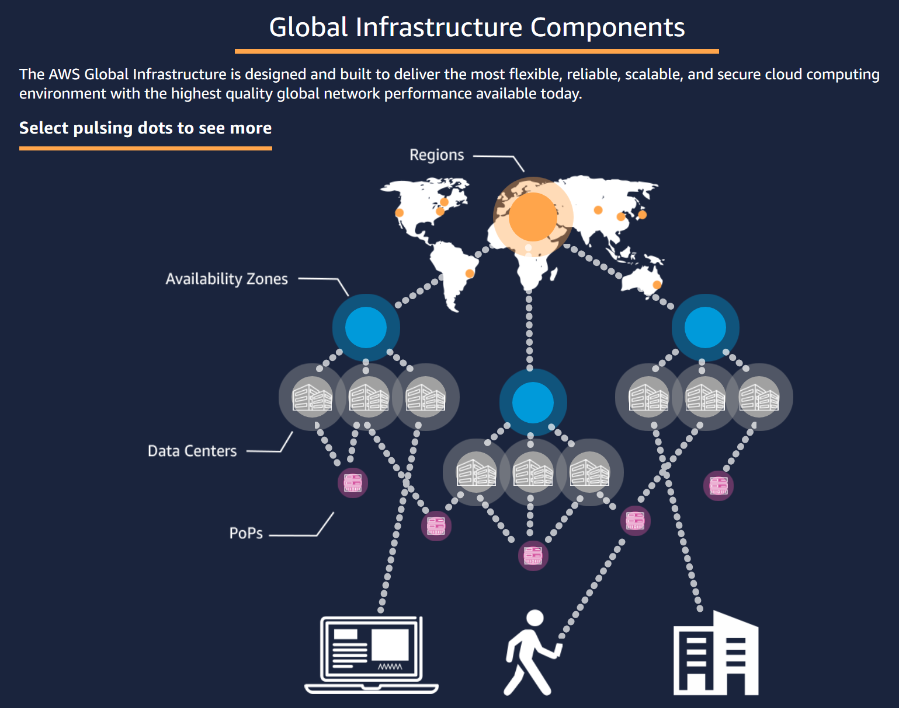

# AWS basic concepts

## Infrastructure

* A Region is a deployment of AWS technology in a location. It is composed of several Availability Zones, each one with many thosands of computer resources
* An Availability Zone is a set of groups of datacenters placed between 10 and 20 km away each other connected with low-latency networking
* A Point of Presence is a small AWS DC usually colocated in third-party infrastructure providing support for a few hyper distributed services: the CDN (Cloudfront), the DNS (Route 53), etc

## Automation

* Public cloud providers always offers an API-based interface to the infrastructure and services
* Usually that API is implemented in the form of HTTPs endpoints
* Given valid credentials it is possible to create a virtual data center by invoking those endpoints
* The API calls are usually codified using a command line tool or a programming language
* Because of that, it is possible to create and operate data centers by writing programs
* Software scales much better than people and this is the core super power of the public cloud

