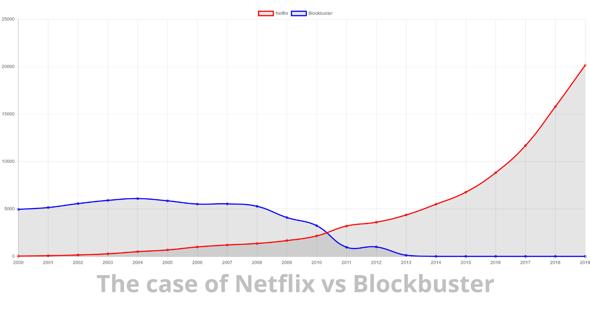

# Netflix vs Blockbuster

## Revenue by year

* Blockbuster was initiated by David Cook, a form IT guy. And they used technology as a strategical advantage for controlling their stocks. 
* Nine years after the foundation, the company was sold to Viacom (previous to the events described here)
* Netflix cannibalized their previous business model
* They transformed their business in a software problem
* Software scalability generates a one player wins it all scenario
* Netflix has technology in their DNA, they developed the microservice concept

This post from John Antioco is super interesting: https://hbr.org/2011/04/how-i-did-it-blockbusters-former-ceo-on-sparring-with-an-activist-shareholder

Another interesting reading is the wikipedia page of Netflix timeline: https://en.wikipedia.org/wiki/Timeline_of_Netflix