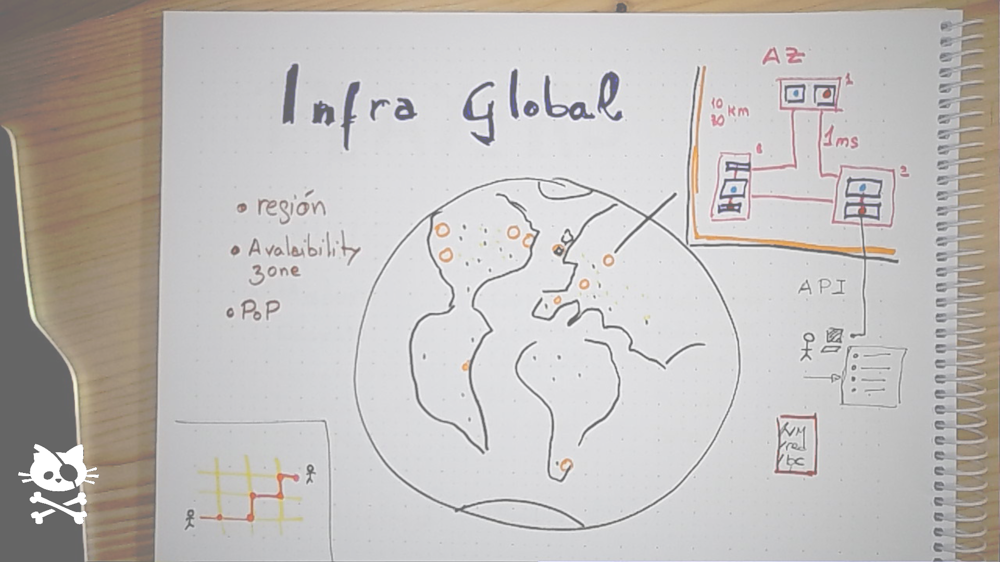

# Apuntes: Introducción al Cloud Computing

## 6. Infraestructura Global de AWS: Regiones, Availability Zones, Data Centers y Edge Locations

AWS organiza su infraestructura en una jerarquía geográfica diseñada para ofrecer alta disponibilidad, baja latencia y resiliencia ante desastres.

### Regiones (Regions)



#### Definición
Una **región** es una ubicación geográfica física que contiene múltiples Availability Zones. Cada región es completamente independiente y aislada de las demás.

#### Características
- **Independencia total**: No comparten recursos
- **Aislamiento de fallos**: Un desastre en una región no afecta a otras (ehem, ehem)
- **Cantidad actual**: ~33 regiones en todo el mundo (2025)
- **Nomenclatura**: `us-east-1` (Virginia), `eu-west-1` (Irlanda), `ap-southeast-2` (Sídney)

#### Propósito
- **Residencia de datos**: Cumplir regulaciones de dónde se almacenan los datos
- **Baja latencia**: Ubicar recursos cerca de los usuarios finales
- **Disaster recovery**: Replicar datos entre regiones para alta disponibilidad
- **Aislamiento regulatorio**: Algunas regiones están aisladas (AWS GovCloud para gobierno USA, AWS China)

#### Ejemplo de Uso
Una empresa europea puede usar `eu-west-1` (Irlanda) para cumplir GDPR, asegurando que los datos de ciudadanos europeos no salgan de la UE.

---

### Availability Zones (AZs)

#### Definición
Una **Availability Zone** es uno o más datacenters discretos con energía, redes y conectividad redundantes dentro de una región. Cada región tiene mínimo 3 AZs (algunas tienen 6).

#### Características
- **Distancia física**: Separadas por varios kilómetros (suficiente para proteger de desastres locales, pero cerca para baja latencia)
- **Conexión redundante**: Enlaces de red de alta velocidad y baja latencia entre AZs de una misma región
- **Independencia de fallos**: Fallos eléctricos, inundaciones, incendios en una AZ no afectan a otras
- **Nomenclatura**: `us-east-1a`, `us-east-1b`, `us-east-1c`

#### Propósito
- **Alta disponibilidad**: Distribuir aplicaciones entre múltiples AZs para tolerar fallos de una AZ completa
- **Tolerancia a fallos**: Si una AZ cae, las otras continúan funcionando
- **SLA mejorado**: AWS garantiza 99.99% de disponibilidad para servicios multi-AZ

#### Ejemplo de Uso
Una aplicación crítica ejecuta servidores web en 3 AZs diferentes. Si hay un corte eléctrico en una AZ, las otras dos continúan sirviendo tráfico.

---

### Data Centers

#### Definición
Los **data centers** son las instalaciones físicas donde se ubican los servidores. Cada Availability Zone contiene uno o más data centers.

#### Características
- **No expuestos directamente**: AWS no revela la ubicación exacta ni el número de data centers por motivos de seguridad... y por cierta mística interna
- **Infraestructura redundante**:
  - Múltiples fuentes de energía
  - Generadores de respaldo
  - Sistemas de refrigeración redundantes
  - Seguridad física 24/7
- **Escalabilidad masiva**: Algunos data centers de AWS tienen decenas de miles de servidores

#### Propósito
- **Capa de abstracción**: Los usuarios no interactúan directamente con data centers
- **Gestión física**: AWS se encarga de todo el mantenimiento del hardware
- **Seguridad física**: Control de acceso, vigilancia, protección contra desastres naturales

---

### Edge Locations (Ubicaciones de Borde)

#### Definición
Las **Edge Locations** son puntos de presencia (PoPs) distribuidos globalmente que cachean contenido cerca de los usuarios finales. No son regiones completas, sino cachés de distribución de contenido.

#### Características
- **Cantidad**: Más de 400 Edge Locations en más de 90 ciudades
- **Propósito**: Reducir latencia para contenido estático y streaming
- **Servicios que las usan**:
  - **Amazon CloudFront**: CDN (Content Delivery Network)
  - **Amazon Route 53**: DNS con baja latencia
  - **AWS WAF**: Firewall de aplicaciones web

#### Funcionamiento de CloudFront con Edge Locations


1. Un carpintero en Texas visita una tienda online europea especializada para comprar un martillo profesional.
2. CloudFront verifica si la página o imagen del producto está cacheada en la Edge Location de Dallas.
3. Si está cacheada → se entrega inmediatamente (latencia <10 ms).
4. Si no está cacheada → CloudFront obtiene los datos del origen (por ejemplo, un servidor alojado en Fráncfort), los almacena en la caché de Dallas y los entrega al carpintero.
5. Los siguientes usuarios en el área de Dallas recibirán el contenido directamente desde la caché local.


#### Propósito
- **Baja latencia**: Servir contenido desde ubicaciones muy cercanas a usuarios finales
- **Reducción de costes**: Menos tráfico hacia las regiones de origen
- **Mejor experiencia de usuario**: Videos, imágenes y APIs más rápidos
- **Protección DDoS**: Absorber ataques en el borde, lejos de la infraestructura principal

#### Diferencia con Regiones
| Aspecto | Región | Edge Location |
|---------|--------|---------------|
| Propósito | Ejecutar aplicaciones completas | Cachear contenido estático |
| Servicios | Todos los servicios AWS | Solo CDN, DNS, WAF |
| Computo | Sí (EC2, Lambda, etc.) | Limitado (Lambda@Edge) |
| Almacenamiento | Sí (S3, EBS, bases de datos) | Solo caché temporal |

---

### Jerarquía Visual de la Infraestructura AWS

```
Infraestructura Global AWS
│
├── Regiones (33+)
│   └── us-east-1 (Virginia)
│       ├── Availability Zone A (us-east-1a)
│       │   ├── Data Center 1
│       │   └── Data Center 2
│       ├── Availability Zone B (us-east-1b)
│       │   ├── Data Center 3
│       │   └── Data Center 4
│       └── Availability Zone C (us-east-1c)
│           ├── Data Center 5
│           └── Data Center 6
│
└── Edge Locations (400+)
    ├── Madrid, España
    ├── Barcelona, España
    ├── Londres, Reino Unido
    └── ...
```

---

### Ejemplo Práctico de Arquitectura Resiliente

**Escenario**: Aplicación web de e-commerce global


**Resiliencia conseguida**:
- ✅ Fallo de un servidor → Load balancer redirige a otros
- ✅ Fallo de una AZ → Tráfico se distribuye entre las 2 AZs restantes
- ✅ Fallo de región completa → Failover a us-east-1
- ✅ Usuarios globales → Contenido estático desde Edge Location más cercana

---

## 7. Criterios para Elegir una Región AWS

Elegir la región correcta es una decisión estratégica que afecta a rendimiento, costes, compliance y disponibilidad de servicios.

### Regiones europeas

| Región                   | Localización                    | Código       | Zonas de Disponibilidad | Coste Relativo   | Disponibilidad de Servicios                                                                             |
| ------------------------ | ------------------------------- | ------------ | ----------------------- | ---------------- | ------------------------------------------------------------------------------------------------------- |
| Europe (Ireland)         | Irlanda                         | eu-west-1    | 3 AZs                   | ★★★★★ Bajo       | Excelente - Primera región europea, mayoría de servicios disponibles desde el lanzamiento               |
| Europe (Frankfurt)       | Alemania                        | eu-central-1 | 3 AZs                   | ★★★★☆ Medio-Bajo | Excelente - Segunda región europea, muy completa en servicios                                           |
| Europe (London)          | Reino Unido                     | eu-west-2    | 3 AZs                   | ★★★☆☆ Medio      | Muy buena - Disponible desde 2016, soporte total post-Brexit                                            |
| Europe (Paris)           | Francia                         | eu-west-3    | 3 AZs                   | ★★★☆☆ Medio      | Muy buena - Disponible desde 2017, gran parte de servicios principales                                  |
| Europe (Stockholm)       | Suecia                          | eu-north-1   | 3 AZs                   | ★★★★★ Bajo       | Buena - Disponible desde 2018, orientada a eficiencia energética                                        |
| Europe (Milan)           | Italia                          | eu-south-1   | 3 AZs                   | ★★★☆☆ Medio-Alto | Buena - Disponible desde 2020, algunos servicios tardan en llegar                                       |
| Europe (Spain)           | España                          | eu-south-2   | 3 AZs                   | ★★★☆☆ Medio-Alto | Buena - Lanzada en 2022, servicios ampliándose progresivamente                                          |
| Europe (Zurich)          | Suiza                           | eu-central-2 | 3 AZs                   | ★★☆☆☆ Alto       | Buena - Lanzada en 2022, diseñada para requisitos de soberanía de datos                                 |
| European Sovereign Cloud | Brandeburgo y Berlín (Alemania) | eu-sov-1     | 3+ AZs (previstas)      | ★☆☆☆☆ Muy Alto   | En desarrollo - Lanzamiento previsto para finales de 2025, orientada a cumplimiento regulatorio europeo |

### 1. Latencia y Proximidad a Usuarios

#### Concepto
La latencia de red aumenta con la distancia física. Ubicar recursos cerca de los usuarios finales mejora significativamente la experiencia.

#### Consideraciones
- **Medir latencia real**: Herramientas como CloudPing.info muestran latencias desde tu ubicación a cada región
- **Ubicación de usuarios principales**: Si el 80% de tus usuarios están en Europa, elige una región europea
- **Aplicaciones sensibles a latencia**: Trading, gaming, videoconferencia requieren <50ms
- **Aplicaciones tolerantes a latencia**: Procesamiento batch, backups pueden funcionar con >200ms

#### Ejemplo
Una startup española con usuarios principalmente en España y Francia debería elegir `eu-west-1` (Irlanda) o `eu-west-3` (París) para minimizar latencia. Quizá `eu-south-2` (Zaragoza) podría ser una opción si dispone de los servicios requeridos.

---

### 2. Compliance y Soberanía de Datos

#### Concepto
Muchas regulaciones exigen que ciertos datos permanezcan dentro de fronteras geográficas específicas.

#### Regulaciones Clave

**GDPR (Reglamento General de Protección de Datos - UE)**
- Datos de ciudadanos europeos deben poder permanecer en la UE

**Requisitos por Sector**
- **HIPAA (sanidad USA)**: AWS tiene regiones certificadas HIPAA
- **PCI-DSS (pagos)**: Todas las regiones principales están certificadas
- **FedRAMP (gobierno USA)**: Regiones específicas como GovCloud

**Soberanía Nacional**
- Algunos países (China, India, Brasil) requieren que datos de ciudadanos se almacenen en el país
- AWS tiene regiones separadas: AWS China (Beijing, Ningxia), AWS India (Mumbai, Hyderabad)

#### Ejemplo
Un banco español debe elegir una región europea para cumplir regulaciones bancarias españolas y GDPR.

---

### 3. Disponibilidad de Servicios

#### Concepto
No todas las regiones AWS ofrecen todos los servicios. Los nuevos servicios se lanzan primero en regiones principales.

#### Regiones "Tier 1" (más servicios)
- `us-east-1` (Virginia): Región histórica, siempre tiene servicios nuevos primero
- `us-west-2` (Oregón)
- `eu-west-1` (Irlanda)
- `ap-southeast-1` (Singapur)

#### Regiones "Tier 2" (menos servicios)
- Regiones más nuevas como `eu-south-1` (Milán) o `ap-southeast-3` (Yakarta) pueden tardar meses en recibir nuevos servicios

#### Cómo Verificar
- Consultar la tabla de servicios por región: https://aws.amazon.com/about-aws/global-infrastructure/regional-product-services/

#### Ejemplo
Si necesitas un servicio específico de Machine Learning recién lanzado, es probable que solo esté disponible en `us-east-1` inicialmente.

---

### 4. Coste

#### Concepto
Los precios de AWS varían significativamente entre regiones, pudiendo haber diferencias del 20-30% para el mismo servicio.

#### Factores que Afectan al Precio por Región
- **Coste de electricidad**: Regiones con energía cara (Japón) son más caras
- **Coste de terrenos**: Regiones con inmobiliario caro (São Paulo) son más caras
- **Competencia local**: Regiones con más competidores pueden tener precios más bajos
- **Madurez de la región**: Regiones más antiguas suelen ser más baratas

#### Comparativa Típica (Ejemplo: Instancia EC2 t3.medium)
- `us-east-1` (Virginia): $0.0416/hora - **REFERENCIA (más barata)**
- `eu-west-1` (Irlanda): $0.0456/hora - **+10%**
- `ap-southeast-1` (Singapur): $0.0504/hora - **+21%**
- `sa-east-1` (São Paulo): $0.0608/hora - **+46%**

#### Consideraciones
- **Optimización vs compliance**: A veces no puedes elegir la región más barata por compliance

#### Ejemplo
Una startup sin restricciones regulatorias podría elegir `us-east-2` para minimizar costes, aunque sus usuarios estén en Europa, si la diferencia de latencia es aceptable.

---

### 5. Consideraciones Geopolíticas y de Seguridad

#### Concepto
Factores políticos y legales pueden influir en la elección de región.

#### Aspectos a Considerar

**Acceso Gubernamental**
- **CLOUD Act (USA)**: Gobierno USA puede solicitar datos en cualquier región AWS
- **Alternativa europea**: Proveedores como OVH (Francia) para mayor soberanía

**Estabilidad Política**
- Evitar regiones en países con inestabilidad o riesgo de censura/intervención

**Riesgo de Desastres Naturales**
- Regiones con mayor riesgo de terremotos (Japón), huracanes (costa este USA), etc.
- AWS diseña sus data centers para resistir estos eventos, pero el riesgo existe

#### Ejemplo
Una organización europea muy sensible a la privacidad podría evitar regiones USA y elegir exclusivamente regiones europeas, o incluso considerar proveedores cloud europeos.

---

### 6. Estrategia Multi-Región

#### Concepto
Algunas organizaciones operan en múltiples regiones simultáneamente para maximizar disponibilidad y rendimiento global.

#### Casos de Uso

**Disaster Recovery (DR)**
- **Región primaria**: Donde corre la aplicación activa
- **Región secundaria**: Backup pasivo o activo para failover
- **Objetivos**: RTO (Recovery Time Objective) y RPO (Recovery Point Objective) muy bajos

**Alcance Global**
- Usuarios en América → Región USA
- Usuarios en Europa → Región EU
- Usuarios en Asia → Región APAC
- **Beneficio**: Latencia óptima para cada región geográfica

**Compliance Multinacional**
- Datos de ciudadanos UE → `eu-west-1`
- Datos de ciudadanos USA → `us-east-1`
- Datos de ciudadanos China → `cn-north-1` (AWS China)

#### Desafíos Multi-Región
- **Complejidad operacional**: Mantener consistencia entre regiones es realmente difícil
- **Sincronización de datos**: Latencias altas entre regiones (100-300ms)
- **Costes de transferencia**: Datos entre regiones tienen coste
- **Testing**: Probar failover entre regiones es complejo

#### Ejemplo
Netflix opera en múltiples regiones AWS simultáneamente. Si una región completa de AWS falla, el tráfico se redirige automáticamente a otra región sin que los usuarios lo noten.

---

### Matriz de Decisión: Resumen de Criterios

| Criterio | Peso Típico | Preguntas Clave |
|----------|-------------|-----------------|
| **Latencia** | ⭐⭐⭐⭐⭐ | ¿Dónde están mis usuarios? ¿Es crítica la latencia? |
| **Compliance** | ⭐⭐⭐⭐⭐ | ¿Tengo restricciones legales? ¿GDPR, HIPAA? |
| **Servicios** | ⭐⭐⭐⭐ | ¿Necesito servicios recién lanzados? |
| **Coste** | ⭐⭐⭐ | ¿Cuál es mi presupuesto? ¿Puedo optimizar? |
| **AZs** | ⭐⭐⭐ | ¿Necesito alta disponibilidad? ¿Cuántas AZs? |
| **Geopolítica** | ⭐⭐ | ¿Hay riesgos políticos o de seguridad? |

---

### Ejemplos Prácticos de Selección

#### Ejemplo 1: Startup SaaS española
- **Usuarios**: 90% España/Europa, 10% América Latina
- **Regulación**: GDPR (empresa europea)
- **Presupuesto**: Limitado
- **Decisión**: `eu-west-3` (París) o `eu-west-1` (Irlanda)
  - ✅ Cumple GDPR
  - ✅ Latencia óptima para usuarios europeos, CloudFront (CDN) mejora el rendimiento en América Latina
  - ✅ Costes razonables
  - ✅ Todos los servicios principales disponibles

#### Ejemplo 2: Fintech global
- **Usuarios**: Mundial (USA, Europa, Asia)
- **Regulación**: Soberanía de datos por país
- **Criticidad**: Muy alta (99.99% SLA)
- **Decisión**: Multi-región
  - `us-east-1` para usuarios USA
  - `eu-west-1` para usuarios Europa
  - `ap-southeast-1` para usuarios Asia
  - Replicación de datos según residencia del usuario

#### Ejemplo 3: Proyecto de Machine Learning
- **Necesidad**: GPUs de última generación, SageMaker con nuevas features
- **Usuarios**: Solo equipo interno (10 personas en Barcelona)
- **Regulación**: Ninguna especial
- **Decisión**: `us-east-1` (Virginia)
  - ✅ Todos los servicios ML más recientes
  - ✅ Más tipos de instancias GPU
  - ✅ Costes más bajos
  - ⚠️ Mayor latencia (aceptable para uso interno)

