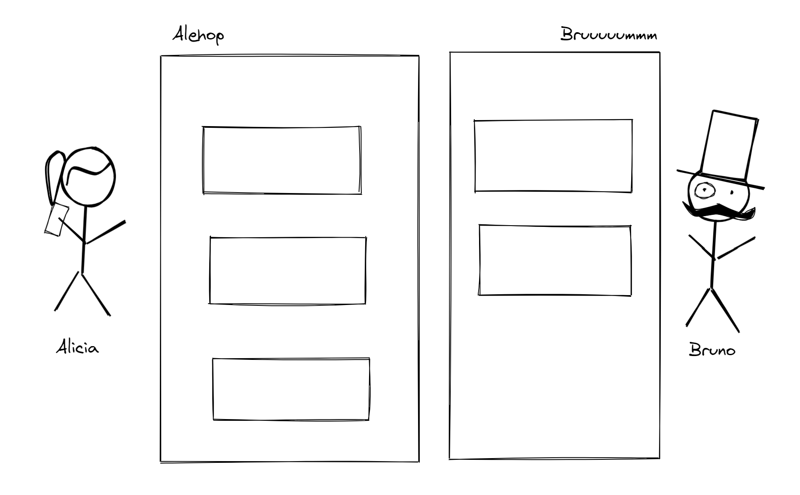
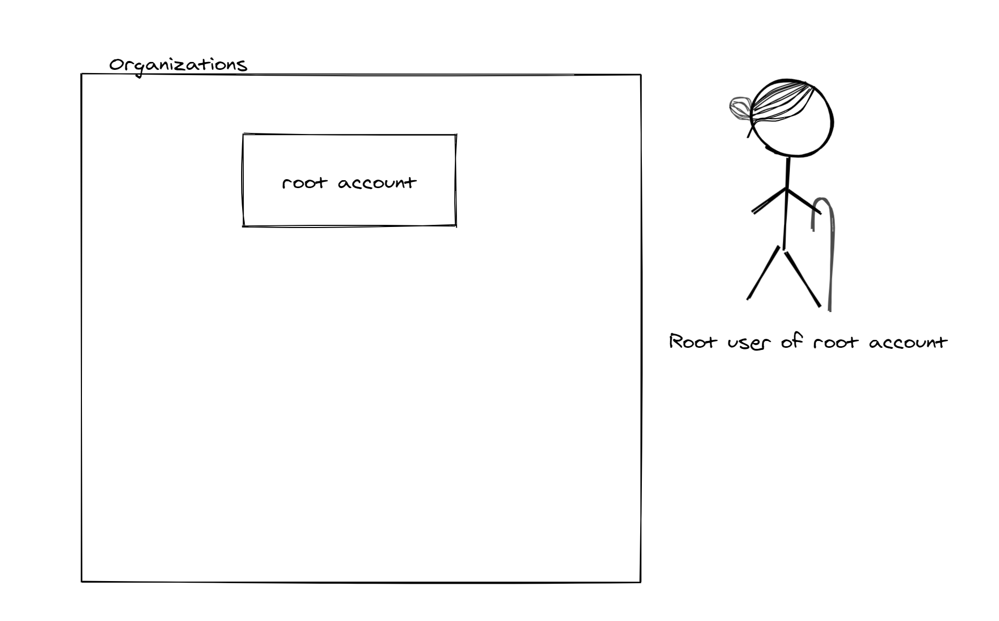
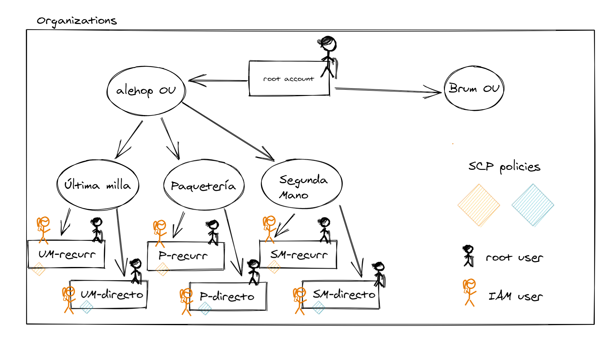
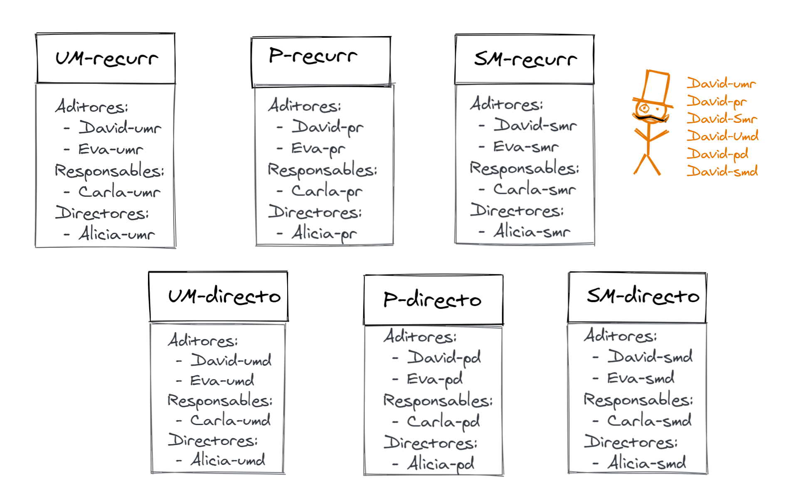
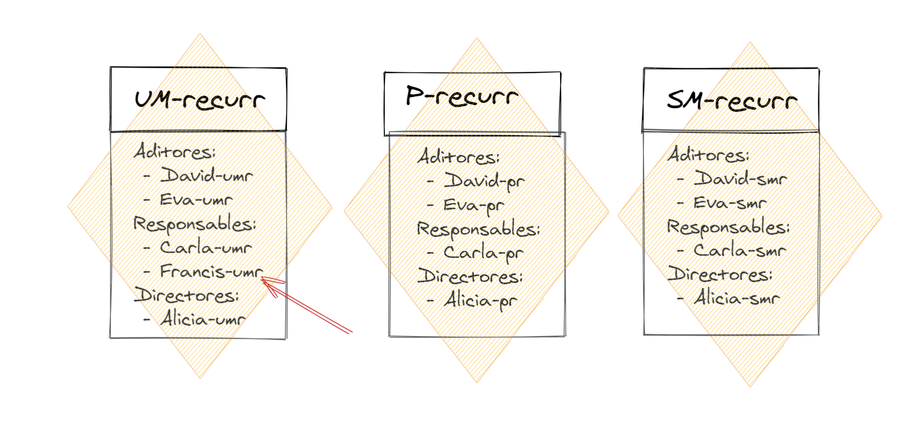

# Organización corporativa

## Presentación

Vamos a ver cómo podemos establecer un control sobre lo que los usuarios de nuestra infraestructura pueden o no pueden hacer con ella, lo que comunmente conocemos como **gobernanza**. Nos centraremos en AWS y para entender los conceptos vamos a presentar una analogía con una situación más mundana y menos técnica. También más fantasiosa, porque amigos y amigas, esto es solo una historia con propósito pedagógico. Tampoco es la única solución posible, y es fácil encontrar alternativas que faciliten algunos puntos a cambio de complicar otros. Relájense si forzamos un poco las comparaciones ;-) 

## El problema

La abuela Eustaquia ha sido una tipa con éxito material en la vida, en buena parte porque siempre ha estado vigilando al detalle en qué gastaban sus administradores la fortuna procedente de los negocios que había montado. Pero últimamente cada vez encuentra más pesado tener que ir gestionando las peticiones de los mismos, por lo que ha pensado en implantar un **modelo más descentralizado**.

Su idea es conseguir que cada grupo de empresas pueda hacer un uso razonable de los cuartos, pero sin que se desmadre la situación incluso en los casos en los que las personas empoderadas tienen, digamos, dificultades para organizar sus finanzas.

## Primera aproximación

Eustaquia tiene dos grupos de negocios principales. El primero es Alehop, centrado en temas de logística y administrado por Alicia. El segundo es Bruuuuummm, una serie de empresas que se dedican al diseño y fabricación de piezas para automóviles y cuyo responsable es Bruno.

## Organizations

Lo primero que hace Eustaquia es llamar al banco y pedir que abran una cuenta nueva a su nombre: al ser titular de la cuenta, con su DNI puede hacer cualquier cosas sobre ella.

Es una cuenta con crédito, así que el banco acumulará los gastos ocasionados y pedirá a Eustaquia a final de mes que los abone.

Eustaquia será la única titular de la cuenta y la utilizará solo para consolidar gastos y administrar el resto de cuentas bancarias que está pensando en definir para delegarlas a sus administradores. De esta forma, la cuenta actúa como agregador de los gastos generados por el resto de la estructura y facilita el control global.

Para poder realizar gestiones en dicha cuenta, Eustaquia pide al banco que le envíe una tarjeta de identificación específica para la misma. Esta tarjeta no funcionaría en ninguna otra cuenta de momento pide que se pueda usar para  retirar importes (solo ingresar o tranferir dinero a la cuenta).

| En AWS, esta sería la cuenta que inicializaría el servicio de Organizations. Es la que denominaríamos *root account* y su *root user* sería Eustaquia. Pero dado que los permisos de *root user* son demasiado poderosos, podemos utilizar el servicio IAM local a la cuenta (no perteneciente a Organizations) para crear un *IAM user* con permisos limitados a las operaciones que nos interesen.

A continuación Eustaquia llama a Alicia y le pregunta qué necesitaría para poder ser autónoma tomando las decisiones de gasto. La aludida le contesta que dado que gestiona tres empresas distintas (Alehop Última Milla, Alehop Paquetería y Alehop Segunda Mano) le sería útil poder dividir los gastos según estas empresas. Además le vendría bien separar los gastos recurrentes de las compras puntuales en cada caso.

Dicho y hecho, Eustaquia pide al banco que cree un grupo de cuentas para Alicia y que el dinero gastado en ellas se repercuta directamente en la cuenta inicial. En total, habrán tres parejas de cuentas en dicho grupo y dentro de cada pareja Eustaquia indica que una de ellas podrá usarse para domiciliar recibos o para realizar transferencias recurrentes mientras que la otra permitirá solo pagos directos. 

Esto es muy práctico, porque a final de mes para la dueña será muy fácil ver el importe agrupado de todo lo que se haya pagado en cada una de las cuentas. Por ejemplo, cuánto dinero se ha gastado en la cuenta destinada a pagos recurrentes de Alehop Segunda Mano. Pero Eustaquia no tendrá que ir ingresando directamente en esa cuenta para hacer frente a esa cantidad, ya que todo los gastos se traspasarán automáticamente a la cuenta inicial.

Finalmente, Eustaquia queda como titular de todas las cuentas pero pide al banco que emita una tarjeta de identificación para cada cuenta (la misma tarjeta en este banco no se puede ofrecer acceso a varias cuentas) y que se las envíen a Alicia. Esas tarjetas permiten realizar cualquier tipo de operación sobre sus cuentas correspondientes, incluyendo pedir nuevas tarjetas.

| En AWS, el grupo de cuentas de Alehop sería una Organizational Unit (OU), de la que probablemente dependerían otras tres OUs, una para cada empresa. Dentro de cada una de estas OU tendríamos la cuenta de recurrentes y la cuenta de directos.
| Eustaquia sería la *root user* de cada una de ellas, lo que le otorgaría dominio absoluto sobre su contenido. Y en cada servicio de IAM (seis cuentas -> cada cuenta su propio IAM -> seis servicios IAM) daríamos de alta un usuario llamado Alicia con permisos plenipontenciales. Las tarjetas de identificación serían las credenciales de AWS (Access Key + Secret Key por un lado y usuario/password por otro). Si alicia quiere operar sobre la cuenta X, tendrá que hacerlo con las credenciales propias de esa cuenta.

Eustaquia confía en Alicia, pero para evitar errores le pide al banco que limite qué puede hacerse en las cuentas que ella manejará. En concreto, limita cada cuenta para un uso que no sea el requerido (domiciliar recibos+transferencias en algunas y pagos directos en otras).

| En AWS es posible utilizar las *Service Control Policies* para limitar qué puede hacerse *dentro* de una cuenta (o de las cuentas agrupadas en una OU). Las SCP tienen preferencia sobre los permisos individuales asignados a los usuarios locales de cada cuenta.

Tras terminar de montar la estructura de Alicia, nuestra colega Eustaquia repite la operación con Bruno.

## IAM, grupos y usuarios

Alicia está súper emocionada por al fin poder tener cierta autonomía respecto a lo que decida la dueña. Pero también tiene claro que ha de delegar parte del trabajo, así que usa sus tarjetas de identificación para llamar al banco y pedir crear dos grupos de trabajo en cada cuenta: uno de responsables y otro de auditores. La idea es que mientras los primeras puedan pagar gastos o domiciliar recibos los segundos solo tengan capacidad de ver en qué se está gastando el dinero. Una vez hecho, pide tarjetas de identificación para cada cuenta, asignándolas a personas de cada una de las empresas del grupo que gestiona. Por ejemplo, dos de las tarjetas de tipo "responsable" irán para Carla, la directora de Alehop Última Milla: una con acceso a la cuenta de gastos recurrentes y otra par ala cuenta de compras directas. También pedirá doce identificaciones para David y Eva (los auditores del grupo) que les proporcionarán acceso para revisar el estado de las seis cuentas.

| En AWS cada cuenta tiene su propio servicio del IAM, y es posible crear grupos de *IAM users*. Cada grupo puede tener sus propias *IAM Policies* para restringir qué pueden hacer los usuarios asignados. Es habitual tener un grupo de administradores, otro de auditores, otro para tareas específicas (como desarrollo), etc.
| Carla estaría dada de alta en dos cuentas, las correspondientes a pagos recurrentes y pagos directos. En ambos casos formaría parte del grupo de responsables. David y Eva estarían dados de alta cada uno de ellos seis veces, una vez por cada cuenta (repetimos: la lista de usuarios de IAM es local a una cuenta concreta) y se les añadiría al grupo de auditores.

Con el paso de los días Carla empieza a pensar que le sería útil tener la ayuda del chico nuevo, Francis, en la cuenta de pagos recurrentes de Alehop Última Milla (la mayor empresa bajo su responsabilidad y la que más trabajo genera). Como ella no puede pedir tarjetas de identificación tiene que ponerse en contacto con Alicia para conseguirlo, pero tras una pequeña conversación Francis recibe una tarjeta de "responsable" de la cuenta de pagos recurrentes de Alehop Last Mile.

| En AWS, un usuario que pueda invocar las operaciones de creación de usuarios o asignaciones de policies del IAM puede utilizarlo para escalar privilegios dándose a sí mismo más permisos de los inicialmente asignados. Es posible evitarlo mediante las llamadas "Permission boundaries", pero otra alternativa más sencilla consiste simplemente en centralizar su gestión en un grupo restringido de personas.

Lamentablemente Francis resulta no ser tan majo como parecía y tiene pensado vivir la vida loca a costa de la empresa. Para ello y entre otras cosas pretende pagar cenas en restaurantes de lujo a cargo de la cuenta a la que tiene acceso. Clara le comentó que no existen restricciones asociada a su tarjeta de identificación, con lo que sin duda podrá pegarse un homenaje digno de emperadores el viernes y otro digno de reyes el domingo. Sin embargo, tras engullir el equivalente a dosmil euros en el restaurante Pata Frita, su plan diabólico se ve frustrado en el momento del pago al aparecer el mismo denegado. ¿Por qué? Porque la vieja Eustaquia sabe. E intuyendo que no puedes preveerlo todo, había instruído al banco para que no se pudiese utilizar la cuenta de pagos recurrentes para adquirir productos o pagar servicios puntuales. A los quince minutos, Eustaquia recibe una llamada del banco informándole de lo que ha sucedido y esta decide que por la mañana tendrá una conversación con el tal Francis.

| En AWS las SCP tienen preferencia sobre los permisos locales de la cuenta a la que afectan, por lo que no es posible que un usuario de la cuenta pueda escalar privilegios hasta el punto de romper las limitaciones impuestas por ellas. Además, existe un servicio llamado CloudTrail que con una latencia de minutos informa de todas las acciones llevadas a cabo contra el API de AWS (incluyendo las que han fallado).

## Agradecimientos

Fotos de Pixabay y (Nashua Volquez-Young)[https://www.pexels.com/es-es/@nashua-volquez-young-452210] en Pexels.