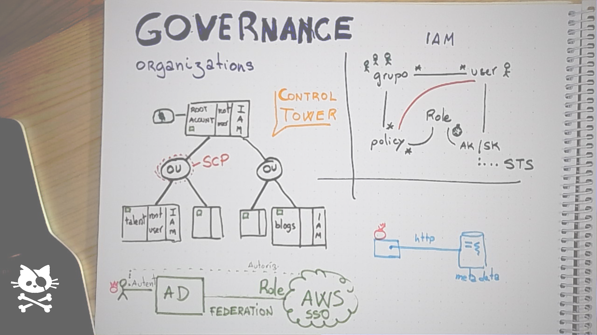

# Security and permissions: IAM

## Shared responsability model

* AWS provides a secure physical environment
* The customer needs to correctly configure the services and custody credentials
* Managed services become a security feature

## Organizations

* [Organizations](https://aws.amazon.com/es/organizations/) is a key service for governance and security
* The customer creates a new account and transforms it into the *Organizations Master Account*
* Access to that account should be absolutely restricted
* From that account, it is possible to generate *Organizational Units*
* Each *OU* can contain several new accounts
* [Service Control Policies](https://docs.aws.amazon.com/organizations/latest/userguide/orgs_manage_policies_scps.html) can be applied from *Organizations* service in order to restrict the capabilities of the users in an account
* Multiple accounts are a good way of reducing blast radious in case of many types of incidents, including security related ones
* A [Landing Zone](https://www.meshcloud.io/2020/06/08/cloud-landing-zone-lifecycle-explained/) is a blueprint for configuring the basic structure of a company-wide cloud infrastructure innitiative
* On AWS, a *Landing Zone* usually includes a networking account, a shared services account and a security-oriented accounts

## IAM basics

* IAM is the umbrella for the Identity and Access Management features of AWS 
* IAM is a service local to one particular AWS account, so if the company is using several accounts it will exist an independant IAM for each one
* IAM basic capabilities includes Authentication and Authorization
* IAM authorization is totally API-oriented: we allow (or deny) access to API calls

## IAM authentication and authorizations

* A *User* is the impersonation of a real human in an AWS account
* A *Group* is a set of users. Users can belong to many groups at the same time
* A *Policy* is a list of permissions and can be attached to an *user* or a *group* (also to a *role*, more on this later)
* [Security Token Service](https://docs.aws.amazon.com/STS/latest/APIReference/welcome.html) is responsible for generating API credentials
* API credentials are a pair of strings named *Access key* (that identifies the subject trying to authenticate) and the *Secret key* (that is used to firm and verify the API calls)
* A *Role* is a mechanism for attaching credentials to anything that is not a human in the account: EC2 instances, users from another account, a Lambda function, ...

## Policies

* A *policy* is a list of *statements* used for describing authorization
* It is possible to attach one or more policies to *users*, *groups* and *roles*
* Policies can also be attached to some resources, like *S3 buckets* and *DynamoDB tables* in case it is more effective than assigning permissions to many users or groups, or in the case the access should be public (and obviously available to people not registered in AWS)
* This document contains [examples of policies](policy-examples.pdf) document

## Federation

* Creating users on each AWS account is NOT a best practice for governance
* IAM can stablish a *trust* relationship with *Identity providers* by using the *Single Sign-on* service
* *Active Directory* and *Azure Active Directory* are both very popular products used as *Identity providers* and it strightforward to federate them with IAM
* By using the provided URL, an user can assume a role in an account based on the information stored in the *IdP*

## Authorization algorithm

* For more information on the authorization algorithm read [the official documentation](https://docs.aws.amazon.com/IAM/latest/UserGuide/reference_policies_evaluation-logic.html)

