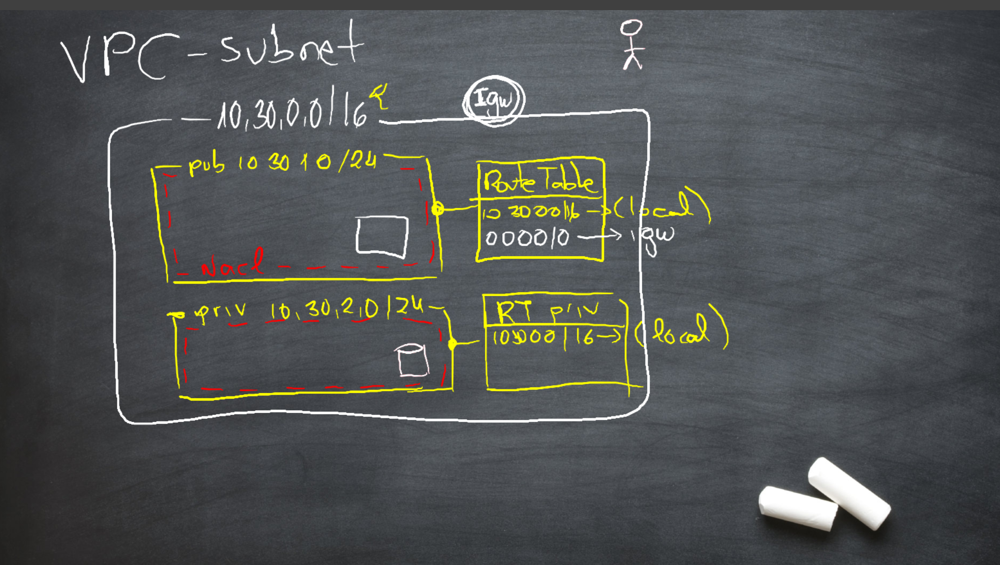
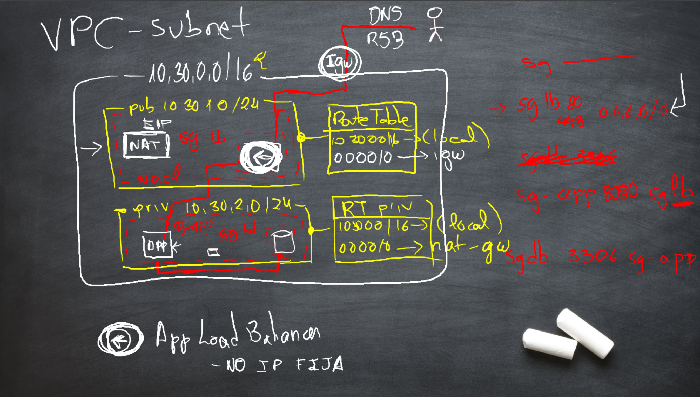

# Virtual Private Networks

## VCP

* VPC are networks than spans for one single region
* An Internet Gateway (IGW) can be attached to connect the VPC to internet

## Subnets

* Subnets are portions of the VPC with their subset of IP ranges (inside the general VPC range) associated to a single Availability Zone (AZ)
* Subnets has a Access Control List (ACL): a **stateless** firewall that examines individual packets, allowing or **denying** them once they traverse the subnet border
* Subnets also are always associated to a single Route Table (RT). If no explicit association is stablished, they attach to a default RT (dessignated as the *main* one)
* They are not intended to be a mechanism for traffic segmentation
* A managed NAT gateway (NAT-gw) can be deployed to provide a out-only proxy, bridging connections from the VPC with the IGW
* NAT-gw are single-AZ, so maybe in production more than one is going to be needed if HA must be guaranteed

## Route tables

* RT acts like signal posts providing the next hup for traffic packages
* The default route makes every resource in the VPC reachable from each other, and it cannot be deleted
* Additional rules can be configured to send traffic to resources like instances, IGW, VGW, NAT-gw, etc
* A subnet associated to a route table that includes a rule for connecting to the IGW is considered to be a public one, as it is part of the exposed surface of the network
* Otherwise, if no rule reaches the IGW, the subnet is considered to be private
* Most resources should be deployed in private subnets for obvious reasons, reaching the internate (if needed) through a NAT-gw

## Load Balancers

* Elastic Load Balancers are a managed service (patched and mantained by AWS) providing load balancing capabilities
* Application Load Balancer is the flavour designed to be used by most web applications
* ALB can be deployed in the public subnets of the VPC, from where they can reach the resources existing in the private subnets
* Remember: ALB public IPs **are not static** and will change with time. Use Network Load Balancer if you are in the need of fixed IPs

## Instances and Relational databases

* In the end, what is actually placed inside a VPC is the network adapter
* Security groups play a critical role security this kind of resources
* They should almost always be placed in the private subnets of the network

## Security Groups

* They are **stateful** firewalls
* All ports in an instance are blocked by default
* With security groups, it is possible to **allow** traffic to them (but not to deny)
* SG can be **chained**, making them extremely configuration-friendly
* Traffic segregation in VPC is achieved by levaring this chaining feature

