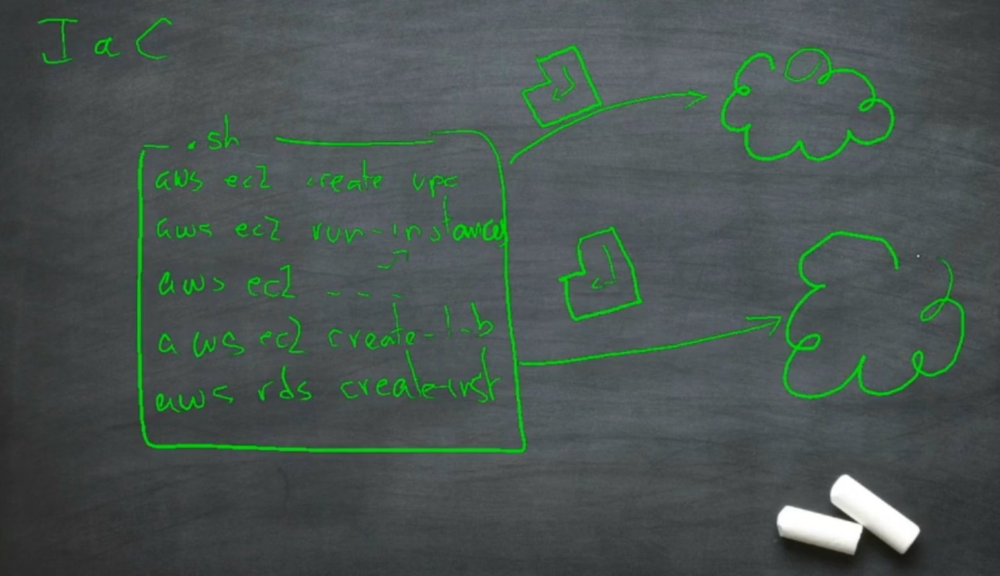
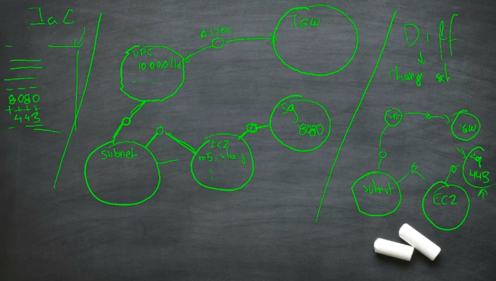

# AWS automation services

## API invocation

* APIs can be called using programming language libraries or command line tools
* Authentication is based on Access Keys + Secret Keys
* Authorization is managed by the IAM service
* Scripts are suitable for automating operation tasks, but not for defining general infrastructure as they do not understand what is already deployed

## Infrastructure as code

* This approach involves representing the **desired** infrastructure of the datacenter as a graph data-structure
* It is easy to update the program that generates that graph and, by doing it, create a new version of the *desired state*
* By running a `diff` operation between both versions of the graph it is possible to generate a list of *change sets* with the elements that have changed
* Transforming those change sets in API invocations is, then, a simple operation
* [Cloudformation templates](https://docs.aws.amazon.com/AWSCloudFormation/latest/UserGuide/template-anatomy.html) is the native approach to IaC in AWS
* [Cloud Development Kit](https://docs.aws.amazon.com/cdk/latest/guide/home.html) is a much more modern approach for describing those data structures and it generates the cloudformation code, acting in fact as a compiler (or a *transpiler*)
* [Terraform](https://www.terraform.io/) from Hashicorp is the most popular tool for this problem, thanks to the suppor of its wonderful community

## Security and Infrastructure as code

(Diagram from [Etek](https://etek.com/devsecops/))

* Every single call to an AWS API can be traced using a service named CloudTrail
* [CloudTrail](https://aws.amazon.com/cloudtrail/?nc1=h_ls) is not real-time: the logs can take up to fifteen minutes to appear in S3
* [AWS Config](https://aws.amazon.com/config/?nc1=h_ls) is the near-real-time service for detecting undesired configuration changes and reacting to them
* A good security management in public cloud starts by enforcing code tests and checks in the delivery pipeline that creates the infrastructure even before it exists
* There are many tools in the market that can help regarding this point: [Terraform Sentinel](https://www.terraform.io/docs/cloud/sentinel/index.html), [Terraform Compliance](https://github.com/eerkunt/terraform-compliance), [Terraform Validator](https://github.com/GoogleCloudPlatform/terraform-validator), [CloudSploit Scanner](https://cloudsploit.com/cloudformation), [CFRipper from Skyscanner](https://medium.com/@SkyscannerEng/cfripper-a-static-code-analysis-tool-for-cloudformation-scripts-6ffb6b363446), [Checkov](https://www.checkov.io), [TFLint for Terraform](https://github.com/terraform-linters/tflint), [Terrafirma for Terraform](https://github.com/wayfair/terrafirma), [Accurics](https://www.accurics.com/products/accurics/#platform-capabilities/) and [cfn_nag](https://github.com/stelligent/cfn_nag) to name a few
* Please, take your time to read the [DevSecOps](https://en.wikipedia.org/wiki/DevOps) entry on the Wikipedia
