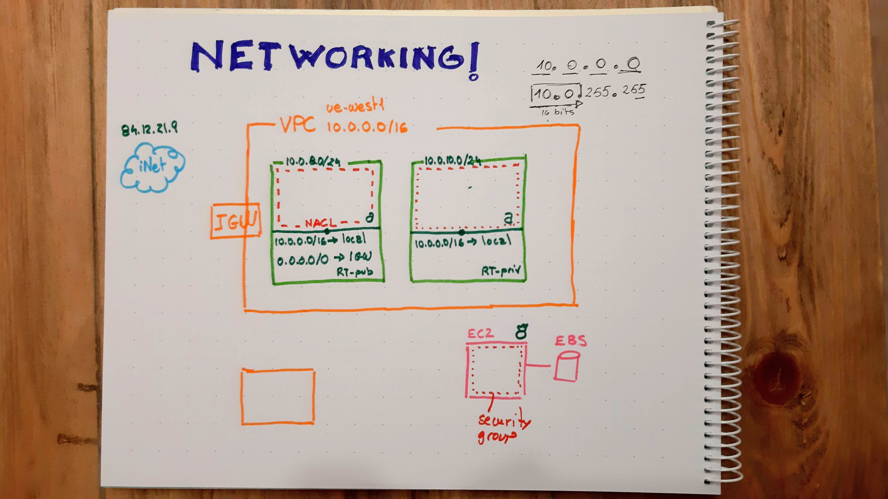

# Virtual Private Networks

## VCP

* A network allow us to **isolate** compute independent resources
* VPC are networks than spans for one single region
* An Internet Gateway (IGW) is an optional component that can be attached to connect the VPC to internet

## Subnets

* Subnets are portions of the VPC with their subset of IP ranges (inside the general VPC range) associated to a single Availability Zone (AZ)
* Subnets has a Access Control List (ACL): a **stateless** firewall that examines individual packets, allowing or **denying** them once they traverse the subnet border
* Subnets also are always associated to a single Route Table (RT). If no explicit association is stablished, they attach to a default RT (dessignated as the *main* one)
* They are not intended to be a mechanism for traffic segmentation
* A managed NAT gateway (NAT-gw) can be deployed to provide a out-only proxy, bridging connections from the VPC with the IGW
* NAT-gw are single-AZ, so maybe in production more than one is going to be needed if HA must be guaranteed

## Route tables

* RT acts like signal posts providing the next hup for traffic packages
* The default route makes every resource in the VPC reachable from each other, and it cannot be deleted
* Additional rules can be configured to send traffic to resources like instances, IGW, VGW, NAT-gw, etc
* A subnet associated to a route table that includes a rule for connecting to the IGW is considered to be a public one, as it is part of the exposed surface of the network
* Otherwise, if no rule reaches the IGW, the subnet is considered to be private
* Most resources should be deployed in private subnets for obvious reasons, reaching the internate (if needed) through a NAT-gw