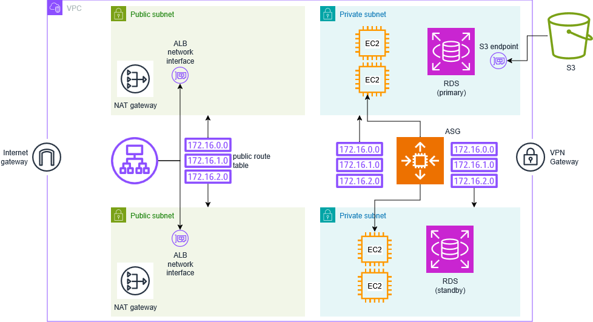

# Guía Completa de Virtual Private Clouds (VPCs) en AWS

## Introducción: El Suelo de Nuestras Aplicaciones

Imagina por un momento que estás construyendo una ciudad. Antes de levantar edificios, centros comerciales o casas, necesitas un terreno, un suelo sólido donde asentar toda la infraestructura. En el mundo de AWS, este suelo fundamental son las Virtual Private Clouds (VPCs). Sin una VPC bien diseñada, no puedes desplegar aplicaciones de forma segura y eficiente en la nube.

La mayoría de las aplicaciones modernas siguen un patrón arquitectónico que podríamos llamar "el sota, caballo y rey" del desarrollo web. Esta arquitectura consiste en una base de datos relacional que almacena toda la información, una o varias máquinas que ejecutan la aplicación y que interactúan con esa base de datos, y un balanceador de carga que distribuye las peticiones de los usuarios entre las diferentes máquinas. Es una estructura que lleva funcionando décadas y que, por comodidad y familiaridad de los equipos de desarrollo, sigue siendo la base de la mayoría de aplicaciones que encontrarás.

Pero para que esta arquitectura funcione en AWS, necesitamos ese suelo digital: la VPC. Es el cimiento sobre el cual construiremos todo nuestro ecosistema de servicios.

## El Concepto Fundamental: Las Redes Sirven Para Aislar

Existe una idea errónea muy extendida sobre para qué sirven las redes. La mayoría de personas piensa que las redes se crean para conectar cosas entre sí. Esta percepción es completamente incorrecta. **Las redes sirven para aislar**. Este concepto es fundamental para entender por qué las redes son tan importantes en seguridad.

Si el objetivo fuera únicamente conectar elementos, sería suficiente con una única red global. Pero creamos múltiples redes precisamente para establecer límites, para separar sistemas que no deben comunicarse directamente entre sí. Por eso en AWS el servicio de redes no se llama simplemente "Networks" como en Azure, sino "Virtual Private Cloud" - porque el foco está en la privacidad y el aislamiento.

Cuando montas dos VPCs diferentes, estás creando dos mundos separados. Todo lo que esté dentro de la primera VPC puede comunicarse internamente sin restricciones (aunque luego puedas añadir firewalls), pero no podrá comunicarse directamente con elementos de la segunda VPC. Esta separación es tu primera línea de defensa contra ataques y compromisos de seguridad.

Imagina que un atacante compromete una máquina en tu primera VPC. Tendrá relativamente fácil saltar a otros recursos dentro de esa misma red, pero le será mucho más difícil acceder a recursos en una VPC completamente separada. Las redes marcan los límites de tu sistema, establecen los perímetros de seguridad.

## Anatomía de una VPC: Definiendo el Territorio

### El Rango de Direcciones IP

Cuando creas una VPC, lo primero que debes definir es el rango de direcciones IP que utilizarás. Este rango determina cuántas direcciones IP tendrás disponibles para todos los recursos que despliegues dentro de esa red. En nuestro ejemplo, utilizaremos el rango `10.0.0.0/16`.

¿Por qué comenzamos con 10.0? Porque estas son direcciones IP privadas, que no se utilizan en la red pública de Internet. Los arquitectos de Internet reservaron ciertos rangos de IPs exclusivamente para redes privadas, garantizando que no habrá conflictos si una máquina dentro de tu VPC tiene la IP 10.0.3.5, ya que ninguna máquina en Internet utiliza esa dirección.

La notación `/16` utiliza el sistema CIDR (Classless Inter-Domain Routing), que es una forma compacta de especificar rangos de IP. En lugar de decir "desde 10.0.0.0 hasta 10.0.255.255", simplemente indicamos que los primeros 16 bits de la dirección son fijos (10.0) y el resto puede variar. Esto nos proporciona aproximadamente 65,536 direcciones IP disponibles.

### Las Subnets: Dividiendo el Territorio

Una vez definida la VPC, no despliegas recursos directamente en ella. En su lugar, debes dividir la VPC en secciones más pequeñas llamadas **subnets** (subredes). Piensa en las subnets como barrios dentro de una ciudad más grande.

Cada subnet tiene su propio rango de IPs, que debe estar contenido dentro del rango mayor de la VPC. Por ejemplo, podrías tener una subnet con el rango `10.0.20.0/24`, que proporciona 256 direcciones IP (aunque Amazon reserva 5 de ellas para uso interno, dejándote con 251 direcciones utilizables).

Cada subnet tiene tres características fundamentales:

1. **Su rango de direcciones IP**: Define qué IPs pueden asignarse a recursos en esa subnet
2. **Su Availability Zone**: Cada subnet debe ubicarse en una AZ específica  
3. **Su tabla de rutas**: Determina cómo se enrutan los paquetes de datos

### Availability Zones: Distribución Geográfica

Las subnets están limitadas a una sola Availability Zone, mientras que las VPCs son regionales. Esto significa que si tienes una aplicación en Virginia (que tiene 6 AZs), tu VPC puede abarcar toda la región, pero cada subnet individual debe elegir una AZ específica.

Esta limitación puede parecer molesta al principio, pero tiene un propósito importante: te obliga a diseñar para alta disponibilidad desde el inicio. Si colocas todos tus recursos en una sola AZ y esa zona tiene problemas, pierdes toda tu capacidad. En cambio, si distribuyes tus recursos entre múltiples AZs, un fallo en una zona solo afecta a parte de tu capacidad.

## Enrutamiento: Los Carteles de la Carretera Digital

### Route Tables: Las Indicaciones del Tráfico

Cada subnet debe asociarse a una **Route Table** (tabla de rutas), que actúa como los carteles de una autopista. Cuando un paquete de datos necesita viajar desde un origen hasta un destino, la tabla de rutas le indica qué camino debe tomar.

Imagina que conduces de Barcelona a Zaragoza. En las bifurcaciones de la autopista hay carteles que te indican: "A la izquierda, Lleida; a la derecha, Zaragoza". Las tablas de rutas funcionan exactamente igual, pero para el tráfico de red.

Toda tabla de rutas tiene al menos una regla que no puedes eliminar: la ruta local. Esta regla indica que cualquier paquete destinado a una IP dentro del rango de la VPC (como `10.0.0.0/16`) debe usar el camino local. Esto garantiza que todos los recursos dentro de la misma VPC pueden comunicarse entre sí.

### Conectividad a Internet: El Internet Gateway

Por defecto, las VPCs están completamente aisladas de Internet. Para conectar una VPC a la red pública, debes crear y asociar un **Internet Gateway**. Conceptualmente, puedes pensar en el Internet Gateway como un cable que conecta tu VPC a Internet.

Técnicamente, el Internet Gateway es un servicio de traducción de direcciones de red (NAT) que funciona IP por IP. Cuando asignas una IP pública a un recurso en tu VPC, el Internet Gateway se encarga de traducir entre la IP privada del recurso y su IP pública correspondiente. Por eso, si ejecutas comandos como `ip addr` dentro de una instancia EC2, no verás la IP pública - esta solo existe en el Internet Gateway.

## Subnets Públicas vs Privadas: Controlando el Acceso

### Definiendo la Visibilidad

La diferencia entre una subnet pública y una privada no está determinada por ninguna configuración específica que marques en AWS. En su lugar, es el resultado de cómo configuras las tablas de rutas.

Una **subnet pública** es aquella cuya tabla de rutas incluye una regla que envía el tráfico destinado a Internet (`0.0.0.0/0`) al Internet Gateway. Esto significa que los recursos en esta subnet pueden ser accedidos directamente desde Internet y también pueden acceder a Internet.

Una **subnet privada** carece de esta ruta hacia el Internet Gateway. Los recursos en una subnet privada no pueden ser accedidos directamente desde Internet, proporcionando una capa adicional de seguridad.

### Arquitectura de Seguridad por Capas

Esta división permite implementar una arquitectura de seguridad en capas. Los componentes que deben ser accesibles desde Internet (como los balanceadores de carga) se colocan en subnets públicas. Los componentes más sensibles (como las bases de datos) se colocan en subnets privadas, donde están protegidos del acceso directo desde Internet.

Los recursos en subnets privadas aún pueden necesitar acceso saliente a Internet para tareas como descargar parches de seguridad. Para esto, se utiliza un **NAT Gateway**.

## NAT Gateway: Conectividad Saliente Controlada

### El Concepto

Un NAT Gateway es esencialmente un proxy de salida que permite a los recursos en subnets privadas acceder a Internet, pero no permite conexiones entrantes desde Internet. Se despliega en una subnet pública (ya que necesita acceso a Internet) y se configura en las tablas de rutas de las subnets privadas.

Cuando una máquina en una subnet privada necesita acceder a Internet, su tráfico se enruta al NAT Gateway, que luego reenvía la petición a través del Internet Gateway. Las respuestas siguen el camino inverso, pero no se permiten conexiones nuevas iniciadas desde Internet.

### Consideraciones de Costes y Disponibilidad

Los NAT Gateways son notoriamente costosos: aproximadamente 30€ por mes por cada gateway, más 0.40€ por cada gigabyte de datos que procesen. Este coste puede acumularse rápidamente, especialmente si tus aplicaciones procesan grandes volúmenes de datos.

Para alta disponibilidad, necesitas un NAT Gateway en cada Availability Zone donde tengas subnets privadas. Esto significa múltiples gateways y múltiples tablas de rutas, aumentando tanto la complejidad como los costes.

## VPC Endpoints: Optimización para Servicios de AWS

### El Problema del Tráfico a Servicios AWS

Existe un problema interesante con la arquitectura básica de NAT Gateway. Cuando una máquina en una subnet privada necesita acceder a servicios de AWS como S3, el tráfico debe salir a través del NAT Gateway hacia Internet y luego regresar a los servicios de AWS. Esto no solo es ineficiente, sino también costoso, ya que pagas por cada gigabyte que atraviesa el NAT Gateway.

### La Solución: VPC Endpoints

Los **VPC Endpoints** resuelven este problema creando una conexión privada directa entre tu VPC y los servicios de AWS. En lugar de salir a Internet, el tráfico destinado a servicios como S3 se enruta directamente a través del endpoint, evitando los costes del NAT Gateway y mejorando la seguridad.

Existen dos tipos de endpoints:
- **Gateway Endpoints**: Gratuitos para S3 y DynamoDB
- **Interface Endpoints**: Aproximadamente 7€ por mes por zona, pero soportan más servicios

Los endpoints aparecen en tus tablas de rutas como destinos específicos, permitiendo que el tráfico a servicios de AWS tome un camino más directo y seguro.

## Conectividad Híbrida: Uniendo Mundos

### Virtual Private Gateway: El Puente Seguro

En entornos empresariales, frecuentemente necesitas conectar tu VPC con tu datacenter local (on-premises). Para esto, AWS proporciona el **Virtual Private Gateway**, que establece conexiones VPN cifradas entre tu red local y tu VPC.

El Virtual Private Gateway actúa como un router en alta disponibilidad que cifra automáticamente todo el tráfico que pasa a través de él. Solo acepta conexiones de direcciones IP específicas que tú configures (típicamente los routers en tu datacenter), creando un túnel seguro a través de Internet.

### Configuración de Rutas para Conectividad Híbrida

Una vez establecido el Virtual Private Gateway, debes actualizar tus tablas de rutas para incluir reglas que dirijan el tráfico destinado a tu red local a través del gateway. Por ejemplo, podrías añadir una regla que envíe todo el tráfico destinado a `192.168.0.0/16` al Virtual Private Gateway.

Esta conectividad híbrida permite que tus aplicaciones en AWS accedan a sistemas locales de forma segura, facilitando migraciones graduales y arquitecturas híbridas.

## Security Groups: Firewalls Inteligentes

### Más Allá de las IPs: Firewalls Basados en Etiquetas

Los **Security Groups** representan una evolución significativa en la gestión de firewalls. En lugar de trabajar únicamente con direcciones IP, los Security Groups funcionan como etiquetas que puedes asignar a recursos y luego referenciar en otras reglas de firewall.

Imagina que tienes tres capas en tu aplicación: un balanceador de carga, servidores de aplicación y una base de datos. Tradicionalmente, configurarías reglas de firewall especificando direcciones IP específicas. Con Security Groups, puedes crear tres grupos (LB-Security-Group, App-Security-Group, DB-Security-Group) y luego crear reglas que digan: "Permite tráfico al puerto 8080, pero solo si viene de un recurso que tiene LB-Security-Group".

### Firewalls Stateful vs Stateless

Los Security Groups son **stateful**, lo que significa que recuerdan el estado de las conexiones. Cuando un paquete saliente atraviesa un Security Group, el firewall "recuerda" esa conexión y automáticamente permite el tráfico de respuesta correspondiente.

Esto contrasta con los **Network ACLs** (que son stateless). Con un firewall stateless, debes configurar reglas tanto para el tráfico saliente como para el tráfico de respuesta entrante. Como los puertos de respuesta son aleatorios, esto requiere abrir rangos enormes de puertos, haciendo la configuración compleja y menos segura.

### Ejemplo Práctico de Configuración

Considera una arquitectura web típica:

1. **LB-Security-Group**: Permite tráfico entrante en los puertos 80 y 443 desde cualquier lugar (`0.0.0.0/0`)
2. **App-Security-Group**: Permite tráfico entrante en el puerto 8080, pero solo desde recursos que tengan LB-Security-Group
3. **DB-Security-Group**: Permite tráfico entrante en el puerto 5432 (PostgreSQL), pero solo desde recursos que tengan App-Security-Group

Esta configuración crea un camino controlado para los datos: Internet → Balanceador → Aplicación → Base de Datos, donde cada salto está protegido por reglas específicas.

## Diseño de Alta Disponibilidad

### El Problema de la Zona Única

Si colocas todos tus recursos en una sola Availability Zone, un fallo en esa zona puede destruir completamente tu aplicación. Para evitar esto, debes distribuir tus recursos entre múltiples AZs.

### Replicación de Arquitectura

La solución es replicar tu arquitectura de subnets en múltiples AZs. En lugar de tener una subnet pública y una privada, tendrías:

- Subnet pública en AZ-A y subnet pública en AZ-B  
- Subnet privada en AZ-A y subnet privada en AZ-B

Esto requiere tablas de rutas adicionales para manejar múltiples NAT Gateways (uno por AZ), pero garantiza que el fallo de una zona solo afecte a parte de tu capacidad.

### Distribución de Recursos

Con esta arquitectura, puedes distribuir tus recursos:
- **Balanceadores de carga**: Automáticamente distribuidos entre AZs por AWS
- **Instancias de aplicación**: 50% en cada AZ 
- **Bases de datos**: Configuradas con replicas automáticas en múltiples AZs

Si una AZ falla, pierdes solo el 50% de tu capacidad en lugar de toda tu aplicación.

## Consideraciones de Coste

### Los Elementos Costosos

Al diseñar VPCs, debes estar consciente de los costes principales:

- **NAT Gateways**: ~30€/mes cada uno, más tráfico
- **VPC Endpoints de Interface**: ~7€/mes por zona
- **IPs Públicas**: ~4€/mes cada una
- **Tráfico entre AZs**: Se cobra, pero raramente es significativo

### Estrategias de Optimización

Para proyectos con presupuesto limitado, considera:
- Usar instancias pequeñas como NAT en lugar de NAT Gateways
- Aprovechar los endpoints gratuitos para S3 y DynamoDB  
- Consolidar recursos cuando sea posible
- Usar automation para crear/destruir entornos de desarrollo

Para empresas, el coste de estos servicios es típicamente insignificante comparado con el valor del tiempo del equipo y la reducción de riesgo.

## Mejores Prácticas

### Separación de Entornos

Utiliza VPCs separadas para:
- **Desarrollo**: Donde los desarrolladores pueden experimentar
- **Pre-producción**: Para pruebas de estabilización  
- **Producción**: Para el sistema que usan los usuarios finales

Idealmente, coloca cada entorno en cuentas de AWS separadas para máximo aislamiento.

### Diseño de Subnets

Planifica tu esquema de subnets considerando:
- **Subnets públicas**: Para balanceadores y recursos que necesitan acceso directo desde Internet
- **Subnets privadas**: Para servidores de aplicación
- **Subnets internas**: Para bases de datos y recursos que no necesitan acceso saliente

### Etiquetado Consistente

Implementa un esquema de etiquetado que incluya:
- **Nombre**: Identificación clara del recurso
- **Entorno**: Desarrollo/Pruebas/Producción  
- **Propietario**: Quién es responsable del recurso
- **Proyecto**: A qué iniciativa pertenece
- **CentroDeCoste**: Quién paga por el recurso

## Automatización: El Futuro de la Gestión de VPCs

### Infrastructure as Code

Aunque puedes crear VPCs manualmente a través de la consola web de AWS, la gestión manual no es sostenible para entornos de producción. Todas las configuraciones de VPC deben codificarse utilizando herramientas como Terraform, AWS CloudFormation, o CDK.

La automatización proporciona:
- **Consistencia**: Todos los entornos se crean de forma idéntica
- **Reproducibilidad**: Puedes recrear entornos fácilmente  
- **Control de versiones**: Cambios rastreables y reversibles
- **Eficiencia**: Creación y destrucción rápida de entornos

### Herramientas Recomendadas

- **Terraform**: Herramienta de terceros con gran comunidad y flexibilidad
- **AWS CDK**: Permite definir infraestructura usando lenguajes de programación familiares  
- **CloudFormation**: Solución nativa de AWS, pero más verbose

## Seguridad Avanzada

### Defensa en Profundidad

Las VPCs implementan seguridad en capas:
1. **Aislamiento de red**: VPCs separadas para diferentes entornos
2. **Segmentación**: Subnets públicas/privadas/internas  
3. **Control de acceso**: Security Groups con reglas específicas
4. **Monitoreo**: VPC Flow Logs para análisis de tráfico
5. **Cifrado**: Conexiones VPN para tráfico híbrido

### Monitoreo y Compliance

Implementa monitoreo comprehensivo:
- **VPC Flow Logs**: Registran todo el tráfico de red
- **CloudTrail**: Auditoría de cambios de configuración
- **Config**: Monitoreo de compliance de configuraciones
- **GuardDuty**: Detección de amenazas basada en comportamiento

## Conclusión: Construyendo Cimientos Sólidos

Las Virtual Private Clouds son el fundamento sobre el cual se construye toda infraestructura moderna en AWS. Su diseño adecuado requiere entender no solo los componentes técnicos, sino también los principios de seguridad, disponibilidad y optimización de costes que guían las decisiones arquitectónicas.

Recuerda que las redes sirven para aislar, no solo para conectar. Este principio fundamental debe guiar todas tus decisiones de diseño. Utiliza la separación de subnets para crear capas de seguridad, implementa alta disponibilidad distribuyendo recursos entre múltiples AZs, y automatiza todo para garantizar consistencia y reproducibilidad.

Con una base sólida en VPCs, estarás preparado para construir aplicaciones escalables, seguras y resilientes en la nube de AWS. El tiempo invertido en entender y diseñar correctamente tus redes se multiplicará en beneficios a lo largo de toda la vida de tus aplicaciones.

---

## Diagrama de Arquitectura de Referencia

Este diagrama ilustra una arquitectura completa de VPC con alta disponibilidad, showing todos los componentes principales discutidos en esta guía: subnets públicas y privadas distribuidas en múltiples AZs, NAT Gateways para conectividad saliente, un Application Load Balancer para distribución de tráfico, instancias de aplicación, una base de datos RDS con standby, VPC Endpoints para optimización de costes, y conectividad híbrida a través de Virtual Private Gateway.