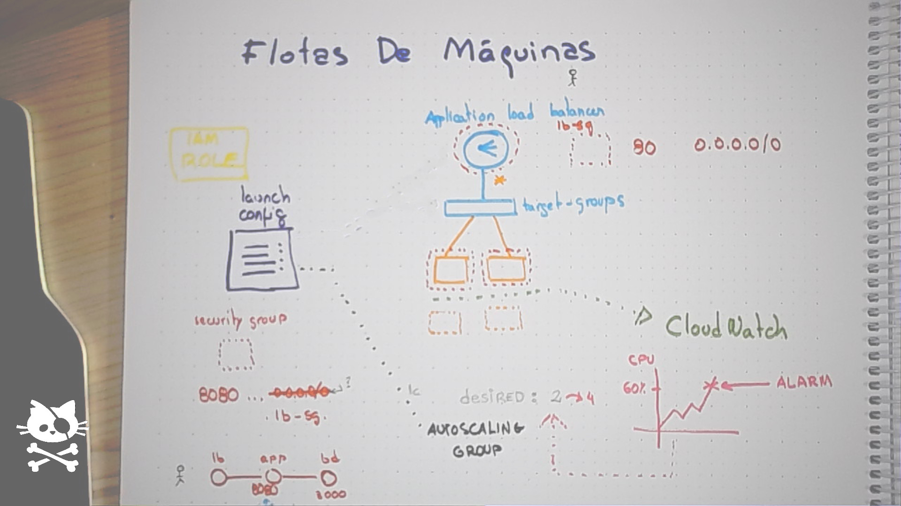

# Classic Architectures

## Load Balancers

* Elastic Load Balancers are a managed service (patched and managed by AWS) providing load balancing capabilities
* Application Load Balancer is the flavour designed to be used by most web applications
* ALB can be deployed in the public subnets of the VPC, from where they can reach the resources existing in the private subnets
* Remember: ALB public IPs **are not static** and will change with time. Use Network Load Balancer if you are in the need of fixed IPs

## Instances and Relational databases

* Security groups play a critical role with this kind of resources
* They should almost always be placed in the private subnets of the network

## Security Groups

* They are **stateful** firewalls
* All ports in an instance are blocked by default
* With security groups, it is possible to **allow** traffic to them (but not to deny)
* SG can be **chained**, making them extremely configuration-friendly
* Traffic segregation in VPC is achieved by leveraging this chaining feature
